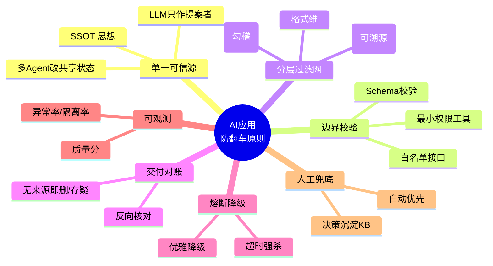

# 开发任何 AI 应用的通用防翻车原则与检查清单

> 适用对象：所有基于大模型（LLM / VLM / Agent）构建的应用——RAG、单 Agent、多 Agent、自动化流水线均适用。
> 核心共识只有一条：**LLM 输出不可信，所有关键决策必须由确定性代码（deterministic gate）把关。**
> 本原则由「多 Agent 防翻车架构」提炼泛化而来；底层全部对应经典软件工程范式（Single Source of Truth、Zero-Trust 边界、Reconciliation、Circuit Breaker、Observability）。

## 思维导图

---

## 一、七大通用原则

### 原则 1 · 单一可信源（Single Source of Truth）
不让 LLM 持有或成为关键数据的"真相"。凡可确定性获取的数据（解析、数据库、规则计算），一律以确定性层为主源；LLM 只作**提案者/补齐者**，永不作主源。
- 对应范式：SSOT。多 Agent 场景进一步要求"废除点对点私聊，改走结构化共享状态"。
- 反模式：把 Agent 之间传递的纸条当成事实、让模型直接输出最终数字。

**示例**
- ✅ 财报分析：数值以 pdfplumber 确定性解析层为主源，LLM 只补缺失科目；LLM 与确定性值分歧 >5% 时一律留确定性主值。
- ✅ 多 Agent：引入"医院病例本"式共享状态，检索角色写 `风险原始数据` 字段、建模角色写 `模型计算结果` 字段，互不覆写，而非互相发消息。
- ❌ 让 LLM 直接输出"总负债 100 亿"作为最终入库值，下游 Agent 当成铁律层层推导，偏差指数级放大。

### 原则 2 · 边界校验（Role Boundary / Zero-Trust Input）
任何进入系统的外部输入（含 LLM 输出、用户上传、工具返回）都必须过**结构化校验**：Schema 约束 + 类型/范围检查 + 白名单。
- 对应范式：最小权限 + 输入验证。Agent 的工具集应**最小必要**（只读工具 + 受闸门保护的写工具，不给 Bash/Write 绕过闸门）。
- 反模式：直接 `eval`/信任 LLM 返回的 JSON、允许 Agent 任意写文件或调外部接口。

**示例**
- ✅ resolver agent 只注册 `bs_candidates()`（只读）、`report_unit()`（只读）、`submit_spec()`（受 `A≈L+E` 闸门保护）等最小工具，**不给 Bash/Write**，使其无法绕过勾稽闸门直写数据库。
- ✅ RAG 应用：对用户 query 与检索结果做 Schema 校验，非法字段直接拒绝，不进 LLM。
- ❌ `json.loads(llm_output)` 后直接 `exec` 执行，或允许 Agent 调 `os.system` 任意命令。

### 原则 3 · 分层过滤网（Layered Validation）
对模型产物做**三维**校验，任一不过即拦截/降级：
1. **格式维**：结构是否符合代码定义的数据模型；
2. **事实维**：关键结论能否在前述可信源中找到溯源引用（span / 出处）；
3. **逻辑维**：与已确认数据是否自相矛盾（勾稽、跨字段业务规则）。
- 对应范式：Validation by deterministic calculators，LLM 不参与裁决。

**示例**
- 格式维：LLM 返回的结构不是合法 JSON / 缺必填字段 → 拒绝。
- 事实维：模型说"该企业负债 100 亿"，但在可信源（解析层）里找不到对应单元格与页码 → 判为无来源幻觉。
- 逻辑维：资产 ≠ 负债 + 权益、或"有息负债 > 总资产" → 勾稽不过，隔离进审查队列。
- 反模式：用"模型很自信"或"概率最高"来代替代码校验。

### 原则 4 · 交付前对账（Reconciliation）
在产物交付给用户/下游前，反向核对：报告里的每句结论、每个数据点，都能在可信源中找到对应字段；无中生有者强制删除或打"存疑"标签。
- 宁可产物因剔除数据而简短，也绝不交付自相矛盾的带病产物。

**示例**
- ✅ 信用备忘录生成前，对账程序逐条核对"报告提到的违约风险"是否能在 `风险` 字段找到依据；找不到则强制删除或贴上"数据存疑"标签。
- ✅ 客服 AI 给退款结论前，反向核对订单状态（可信源），禁止模型凭"我记得你是 VIP"这类无来源说法放款。
- ❌ 模型在报告里写"总负债已突破百亿"，无人对账直接发给客户，事后发现是幻觉。

### 原则 5 · 熔断与优雅降级（Circuit Breaker + Graceful Degradation）
任何外部/模型调用都要有**计时器**与**失败上限**：超时或连续失败即熔断、释放资源，绝不拖垮整体；非核心节点填默认值或跳过，核心节点升级人工/告警。
- 对应范式：Circuit Breaker（《Release It!》）。弱模型/慢接口必须能被硬上限强杀（子进程 kill，而非软超时）。

**示例**
- ✅ 单个报告解析设 `RESOLVER_HARD_CAP=600s`，在独立子进程跑 agent，超时 `subprocess.kill()` 强杀，避免弱模型把本地 GPU/API 占满、拖垮其他任务。
- ✅ LLM 调用设 `LLM_WALLCLOCK=45min` 上限 + 每处 `try/except` 兜底，失败返回确定性默认值而非崩溃。
- ✅ 扫描件无文本层且 `HAS_VLM=False` 时 fail-fast，拒绝静默产出残缺结果。
- ❌ 一个卡死的检索请求无限等待，把整个服务的并发线程全部占满，全线超时。

### 原则 6 · 可观测（Observability）
每个执行节点的消耗（token / 耗时 / 成功率 / 质量分）、异常率、隔离率必须**实时量化**。低质要可测、可监控，而非事后翻案。
- 没有看板，就等于盲飞。

**示例**
- ✅ 看板实时展示：每个 Agent / 每一步的 token 消耗、耗时(ms)、工具调用成功率；批量入库后的"隔离率 / 覆盖率 / grounding 率"报告。
- ✅ 发现某负责日期格式化的小 Agent 竟在调昂贵顶级大模型、日烧几百块且失败率 10% → 立刻换成写死的正则表达式。
- ❌ 等客户投诉"数据错了"才去翻几万行日志找问题。

### 原则 7 · 人工最后兜底（Human-in-the-loop）
自动优先，但**唯一无法自动化**的点（模型穷尽尝试仍失败）由人收尾；人工决策留痕、沉淀为可复用知识（specs / KB），避免反复重试与自动绕过关键闸门。

**示例**
- ✅ 长尾报告解析：agent 自动修正失败（`max_iterations` 用尽或超时）→ 升级人工复核台，业务人员三选一（确认草稿 / 点选正确行 / 标记豁免），所有决策写审计日志。
- ✅ 人工修正沉淀为 `specs/` 与 KB，下次同主体入库自动复用，越早修越省人工。
- ❌ 用 `--signoff` 批量自动放行所有 critical 隔离项，等于关掉质量闸门，污染全局知识库。

---

## 二、三条记忆口诀（三原则法则）

| 口诀 | 含义 |
|------|------|
| **稳信息一致** | 单一可信源 + 严格边界，杜绝"传纸条式"信息失真 |
| **稳任务流转** | 依赖图校验防死锁（多 Agent）/ 超时熔断防卡死（单流程） |
| **稳幻觉不扩散** | 出口过滤 + 交付对账，把错误锁在局部，绝不流向下游 |

---

## 三、落地检查清单（Checklist）

> 每个特性上线前逐条过。✅ = 已落实，❌ = 缺失风险点。

### A. 数据主权与可信源
- [ ] 关键数据是否有**确定性主源**（解析/DB/规则计算），而非依赖 LLM 生成？
- [ ] LLM 是否被限定为"提案/补齐"角色，且**冲突时以确定性值为准**？
- [ ] 多 Agent 场景下，是否存在**结构化共享状态**（非点对点私聊）？
- [ ] 每条结论是否**强制带溯源引用**（page / 坐标 / 字段 id）？

### B. 边界与权限
- [ ] 所有外部/模型输入是否过 **Schema + 类型/范围** 校验？
- [ ] Agent 工具集是否**最小必要**（只读 + 受闸门写，无 Bash/Write 绕过）？
- [ ] 是否**白名单**限制工具/接口调用范围？
- [ ] 写操作是否必须经过**确定性闸门**才落盘（不可被模型直写绕过）？

### C. 校验过滤网
- [ ] 是否实现**格式维**校验（结构合法性）？
- [ ] 是否实现**事实维**校验（关键值可溯源到可信源）？
- [ ] 是否实现**逻辑维**校验（跨字段勾稽 / 业务规则，如 `A≈L+E`）？
- [ ] 校验是否**100% 确定性代码**完成，LLM 不参与裁决？

### D. 交付对账
- [ ] 产物交付前是否做**反向对账**（结论 ↔ 可信源字段）？
- [ ] 无来源 / 自相矛盾项是否**强制删除或标注存疑**，而非静默保留？
- [ ] 是否接受"产物因剔除数据变简短"而不交付带病结果？

### E. 韧性（熔断/降级）
- [ ] 每个外部/模型调用是否有**超时计时器**？
- [ ] 是否有**重试上限 / 失败熔断**，避免无限重试与资源占满？
- [ ] 弱模型/慢接口是否有**硬上限强杀**机制（而非仅软超时）？
- [ ] 非核心失败是否**填默认值/跳过**保持主干通行？
- [ ] 核心失败是否**升级告警/人工**，而非静默降级？

### F. 可观测
- [ ] 是否有**看板**实时展示 token / 耗时 / 成功率 / 质量分？
- [ ] 是否有**异常率 / 隔离率 / 覆盖率**报告？
- [ ] 是否有**隔离/复核队列**可查待审项？

### G. 人机协同
- [ ] 是否**自动化优先**，仅在模型穷尽失败时转人工？
- [ ] 人工决策是否**留痕并沉淀**为可复用知识（specs / KB）？
- [ ] 是否禁止**批量/自动 signoff** 释放关键隔离（防绕过闸门）？

### H. 多 Agent 专属（仅当你用多 Agent 时）
- [ ] 是否存在**有向无环图（DAG）** + 执行前**强规则校验器**（防循环依赖/孤立节点/重复派发）？
- [ ] 各 Agent 是否拥有**隔离的上下文**，且通过共享状态而非纸条通信？
- [ ] 写入共享状态时是否打**版本号 + 时间戳 + 写入者标识**（防幻觉覆写）？
- [ ] 节点出口失败是否触发**局部自愈（重试≤N次）→ 终止 → 降级**，而非全链崩溃？

> **本项目落地设计**：H 节全部条款的 concretization 见 SDK 设计稿 [`packages/sdk/docs/13-orchestrator.md` 的「确定性闸门抽象层」](../../packages/sdk/docs/13-orchestrator.md#确定性闸门抽象层deterministic-gate-abstraction)——DAG 强规则校验器（`DeterministicGate` 三维校验 + `WorkflowEngine` 死锁检测）、隔离上下文 + 共享状态（`SharedStateStore` Blackboard 级，禁文本传纸条）、写版本号+写入者（`version+writer_id` + CAS）、局部自愈→终止→降级（`RetryPolicy` + `ReviewQueue`）。`strict=True` 时全开对标；`strict=False`（默认）仅韧性层在线。

---

## 四、一句话总结

> 真正的工业级 AI 系统，从不建立在"祈祷模型今天不犯错"之上；而是假设模型随时会错、API 随时会挂、网络随时会抖——在极端脆弱前提下，靠强有力工程架构硬拉起一条高可用防线。

多 Agent 开发真正的**分水岭**，不在于用了多炫酷的框架，也不在于系统跑起来多智能，而在于各种意外**接踵而至**时，你的系统能否在复杂交互中**自始至终保持稳健**。
